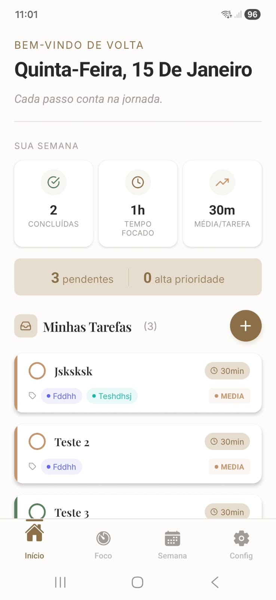
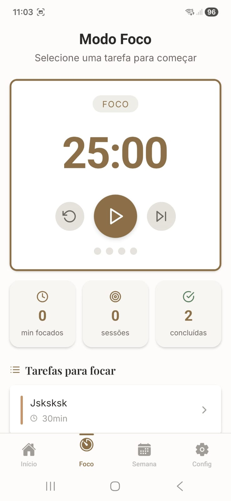
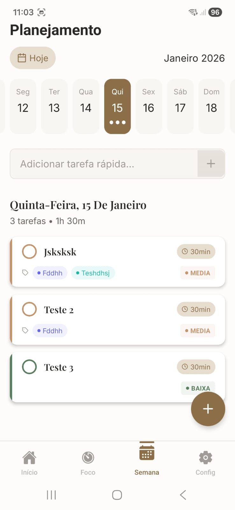

# 📔 Folio - Productivity & Focus App

  

  <b>Um app de produtividade focado em simplicidade e execução.</b> 
  Inspirado no Sunsama, construído para quem quer fazer mais com menos.

---

## 📱 Screenshots

  
  
  

---

## ✨ Funcionalidades

- 📥 **Inbox inteligente** - Capture tarefas rapidamente
- ⏱️ **Timer Pomodoro** - Modo foco com sessões de 25min
- 📅 **Planejamento semanal** - Organize sua semana visualmente
- 🏷️ **Tags personalizadas** - Categorize suas tarefas
- 📊 **Estatísticas** - Acompanhe seu progresso semanal
- 🔗 **Integrações** - Google Calendar (mais em breve)

---

## 🛠️ Stack Tecnológica

| Camada | Tecnologias |
|--------|-------------|
| **Mobile** | React Native, Expo, TypeScript |
| **Web** | React, TypeScript, TailwindCSS |
| **Backend** | Node.js, Express, Prisma |
| **Banco** | PostgreSQL |
| **Auth** | JWT, OAuth 2.0 |

---

## 🎨 Design

- **Estética**: Cozy/Premium com tons terracota e off-white
- **Tipografia**: Playfair Display (títulos) + Inter (corpo)
- **Filosofia**: Menos é mais - foco no essencial

---

## 🚧 Status do Projeto

| Plataforma | Status |
|------------|--------|
| 📱 Mobile (iOS/Android) | 🟢 Em desenvolvimento |
| 💻 Web | 🟢 Em desenvolvimento |
| 🔧 Backend API | 🟢 Funcional |

---

## 👨‍💻 Desenvolvido por

**Ícaro Augusto**  
[LinkedIn](https://www.linkedin.com/in/%C3%ADcaro-augusto-00b567227/) • [GitHub](https://github.com/icaroaugustoh16) • [Email](icarodpvat@gmail.com)

---

  <i>Este repositório é apenas uma vitrine. O código-fonte é privado.</i>

